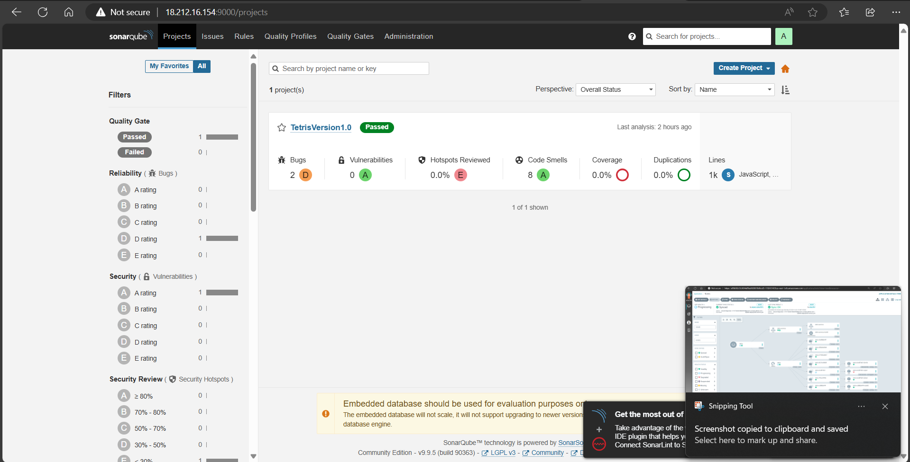
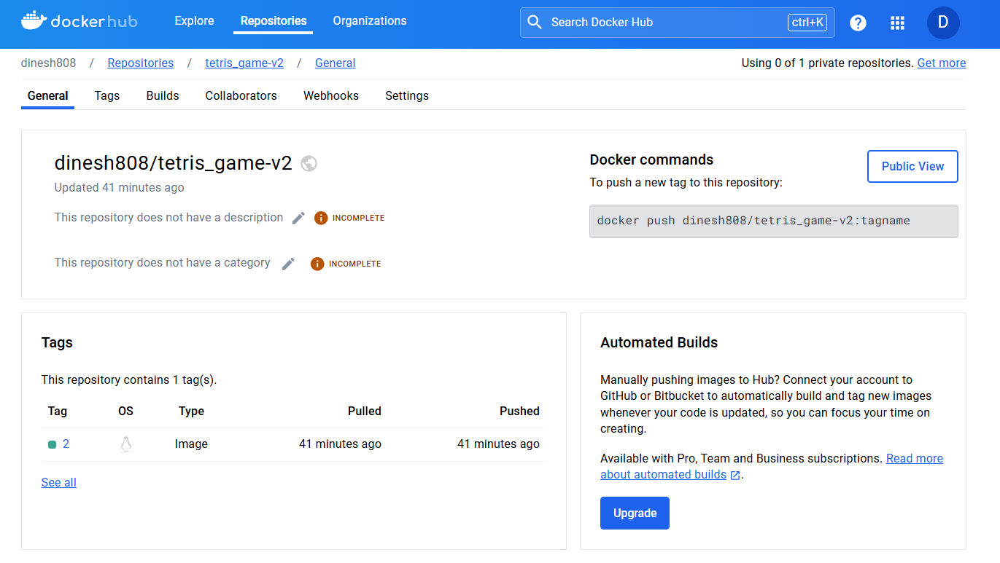
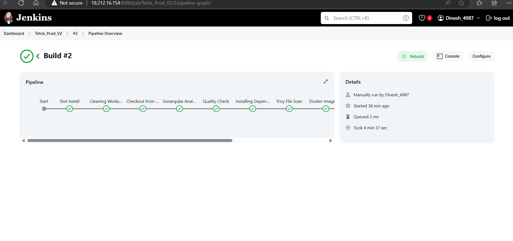
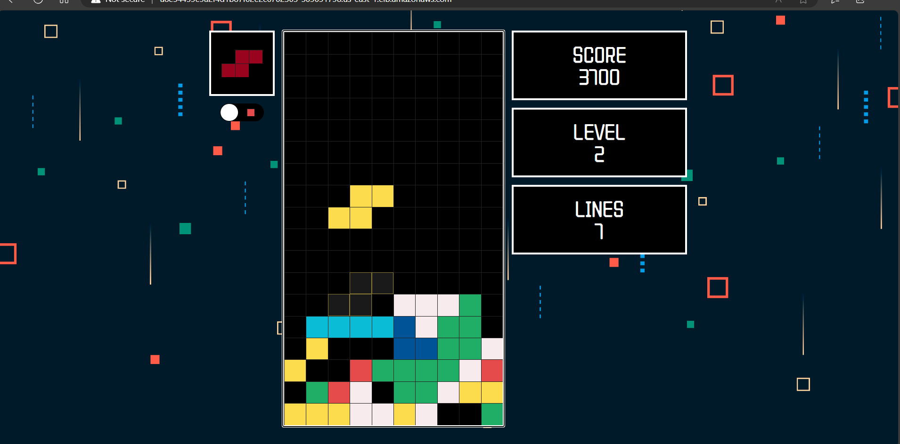

<!DOCTYPE html>
<html lang="en">
<head>
    <meta charset="UTF-8">
    <meta name="viewport" content="width=device-width, initial-scale=1.0">
</head>
<body>

<h1>DevSecOps Mastery: Deploying Tetris on AWS EKS with Jenkins and ArgoCD</h1>

This project demonstrates a DevSecOps pipeline to deploy the Tetris game on AWS EKS using Jenkins and ArgoCD.

<h2>Technologies Used</h2>
<ul>
    <li><strong>Infrastructure</strong>: AWS</li>
    <li><strong>Containerization</strong>: Docker</li>
    <li><strong>Orchestration</strong>: Kubernetes</li>
    <li><strong>CI/CD</strong>: Jenkins, Argo CD</li>
    <li><strong>Security Scanning</strong>: Trivy, SonarQube</li>
    <li><strong>Kubernetes Management</strong>: Kubectl</li>
</ul>

<h2>Project Setup</h2>
<h3>Prerequisites</h3>
<ul>
    <li>AWS Account</li>
    <li>AWS CLI configured</li>
    <li>Kubectl installed</li>
    <li>Docker installed</li>
    <li>Jenkins installed and running</li>
    <li>ArgoCD installed in Kubernetes cluster</li>
</ul>

<h2>Getting Started</h2>
<h3>Step-by-Step Guide</h3>
<ol>
    <li>
        <strong>Clone the Repository</strong>:
        <pre><code>git clone &lt;repository_url&gt;
cd &lt;repository_directory&gt;</code></pre>
    </li>
    <li><strong>Install the Required Dependencies</strong>: Ensure you have AWS CLI, Docker, Kubectl, etc., installed.</li>
    <li><strong>Configure AWS Credentials</strong>: Set up your AWS credentials for CLI.</li>
    <li><strong>Configure Kubernetes Cluster Access</strong>: Ensure kubectl is configured to interact with your EKS cluster.</li>
    <li><strong>Configure the Jenkins Pipeline</strong>: Refer to Jenkins documentation for detailed setup instructions.</li>
    <li><strong>Build and Deploy the Application</strong>: Use the Jenkins pipeline to build and deploy the Tetris application.</li>
</ol>

<h2>Jenkins Pipeline</h2>
<ol>
    <li><strong>Create Pipeline Job</strong>: Create a new pipeline job in Jenkins and configure the Jenkinsfile.</li> -->
    <li><strong>Run Pipeline</strong>: Trigger the pipeline to build and deploy the application.</li>
</ol>

<h2>ArgoCD Deployment</h2>
<ol>
    <li><strong>Create ArgoCD Application</strong>: Define the ArgoCD application YAML and apply it to deploy the application.
        <pre><code>kubectl apply -f argocd-application.yaml</code></pre>
    </li>
</ol>

<h2>Deployment Outputs</h2>
  
This section showcases screenshots from various stages of the deployment process.

<h3>ArgoCD Dashboard</h3>

<h3>Sonarqube Analysis</h3>

<h3>Docker Hub repo</h3>

<h3>Jenkins Job</h3>

<h3>The Tetris Game</h3>

<h2>Additional Notes</h2>
<ul>
    <li><strong>Monitoring</strong>: Set up monitoring for your application using tools like Prometheus and Grafana.</li>
    <li><strong>Security</strong>: Implement security best practices such as using IAM roles, security groups, and network policies.</li>
    <li><strong>Troubleshooting</strong>: Check logs for Jenkins, ArgoCD, and Kubernetes for any issues during deployment.</li>
</ul>

</body>
</html>
